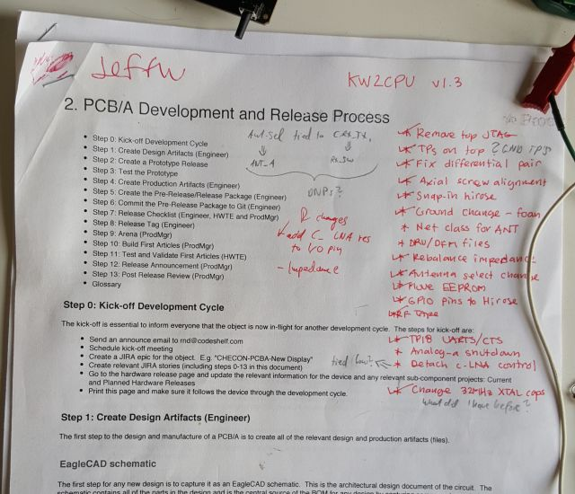

# Kaizen

### From the "Read with a Pen" TinyLetter post.

[https://tinyletter.com/zerodiff/letters/zerodiff-efficient-kaizen-read-with-a-pen](https://tinyletter.com/zerodiff/letters/zerodiff-efficient-kaizen-read-with-a-pen)

Done right, Kaizen reduces mistakes and waste.  But what happens when process itself is the waste?  We all experience this: the application of process to reduce mistakes (and waste) sometimes ends up being worse than the mistakes the new process reduces!   To me, this is a central difficulty to "being in charge."

I started my career in factory automation with a mentor who embraced lean manufacturing decades ahead of its current stylishness.  I would read anything even remotely connected to 1950s-80s Toyota Motor Company.  I read "The Machine that Changed the World" twice.  Because my natural inclination is laziness, "lean process" appeals to me deeply.  So of course I'm a sucker for Eric Ries and Steve Blank's "Lean Startup" movement.  Ditto for "The Pretotyping Manifesto."

The key to lean operation is efficient, well-documented processes that everyone can easily follow and get right.  Our process docs work like checklists.  Checklists have been proven to prevent stupid mistakes by smart people - it's why doctors and pilots use them without exception.

Despite a big investment in good process and documentation, we used to make a lot of repeat mistakes.  It drove me nuts.  One careless mistake by a smart person cost us about $75K.  The harder I tried to stop these, the more frustrated the staff would get.  The psychic load would offset the process wins.  Plus, we'd invest more process only to trade one set of problems for another and have little gain to show for the investment.  Sound familiar?  No one likes this, yet we do it all the time!
 

### Saved by the New York Review of Books

Often, late at night, I vacuum up the Internet on the hunt for cool ideas that I can apply to innovation of all sorts: product, process and people.  One night last year, right after we started ZeroDiff, I ran across this Tim Park essay in the New York Review of Books: 

[http://www.nybooks.com/blogs/nyrblog/2014/dec/03/weapon-for-readers/](http://www.nybooks.com/blogs/nyrblog/2014/dec/03/weapon-for-readers/)  

This sentence from Tim's essay hit me like lightning:
 
A pen is not a magic wand. The critical faculty is not conjured from nothing. But it was remarkable how many students improved their performance with this simple stratagem. There is something predatory, cruel even, about a pen suspended over a text. Like a hawk over a field, it is on the lookout for something vulnerable.

Wow. That one paragraph changed our company!

### Read with a pen

After this article I added a simple instruction to Step 0 of all our process documents:
 
Print this page and make sure it follows the device through the development cycle.

I also request that development cycle leaders handwrite their name at the top and always carry the document with them while they work.  I ask that they have a red pen handy at all times and freely make notes as they go.  These notes can be reminders, edits, additions, removals, or simply complaints to me about stupid stuff.

A cool side effect of this change is that we iterate our process like crazy now because individuals capture high-quality detail in the moment, and then edit the online process docs repo from those notes later.  And we do this without meetings.  Yay!  The process changes so fast that we run the development cycles from the printed document that was live when the cycle started.

Today I end almost every staff meeting with: "OK, folks, and let's not forget: 'Read with a pen!'"  These process docs come back to me when a development cycle completes.  I don't check them in detail - it's really more for me to watch the cadence of this process to ensure that everyone is still onboard.

### Ditch the retrospectives to be really agile

Sure, retrospectives are the de rigueur of agile software development today, but how much do people really remember about what they did last week?  Memory is a fuzzy thing and people tend to remember things emotionally rather than logically.  And do you really want another meeting at all, let alone one where folks with the strongest emotions tend to steer the retrospective?

Now that I've seen it, I know the most important process changes are mundane, complex and nuanced - exactly the unemotional detail bits we fail to commit to memory.  We stopped our retrospectives because at the end of a process the red-pen markups are the process changes!  One person simply commits them straight to Confluence.

### Pens are a powerful Kaizen tool, who knew?

So I got rid of "yet another pointless meeting" and I rooted out all of those frustrating silly mistakes that only smart people make.  As each member of the staff works today they capture those details we often forget, and we easily commit them to the process repo later.  Everyone benefits from these detailed knowledge captures.  

Today, we mostly make "interesting" mistakes - the type that arise from the novel challenges engineers were built to solve.