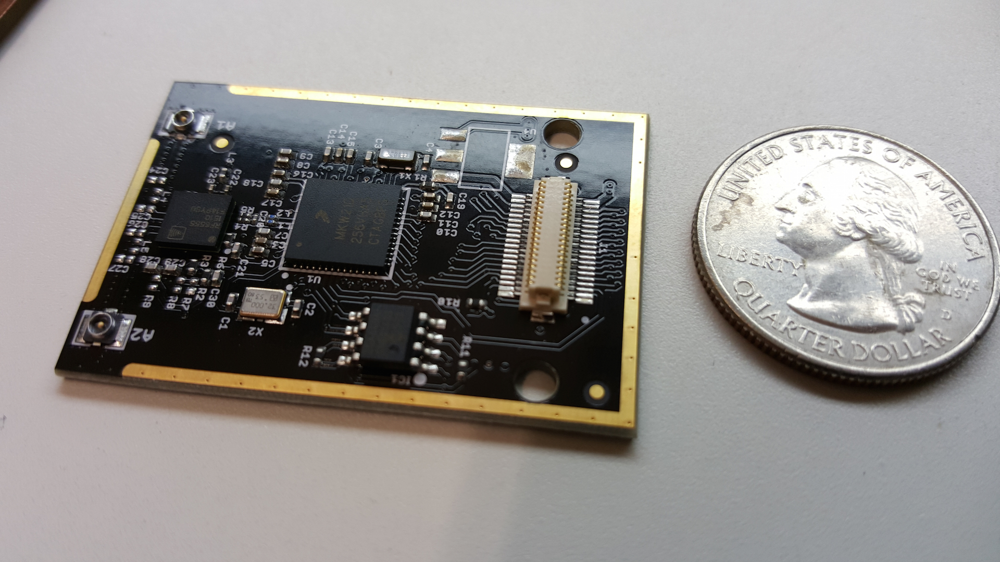

# ZeroDiff

### A New Way to Design and Develop Products

### A Simple Philosophy

>If you maintain zero difference between prototype and production designs, as you rapidly iterate, you can mass produce any revision.

### Corollary

>Always manufacture prototype and production designs on the same tooling - **always**.

## Overview

This site hosts the ZeroDiff process documentation. It captures knowledge that small teams can use to produce high-value objects at low-to-medium volumes. The process is similar to the design and development of modern software: build an MVP and then rapidly iterate design and development. Every iteration, e.g. a github commit, "goes live" with real users in order to perform value testing. This process repeats for an ever-growing user base on an ever-growing product value. The current consensus is that it takes 15 product design iterations to reach maximal user value, so if you want to estimate when your design will reach its optimal mass-production utility, then multiply your iteration cycle time by 15.

## Kill the Waterfall Method (Again!)
### i.e. Crowdsource, Works-Like/Looks-Like, Shenzhen

Prior to the 2000s, software development followed a processed called The Waterfall Method. Product development would follow a sequence: conception, analysis, design, construction and testing. 12-18 months might pass before users saw anything, and if they wanted changes or didn't like features, it might be another 12-18 months before they would see those changes. It was pretty awful, and no good software product designer would ever want to go back to those times. Today, software developers follow a lean or agile practice that involves small, rapid iterations with continual and close user-value testing. Each iteration allows for incremental investments target toward value and user growth.

So why are hard good designers stuck in the Waterfall Methodology? Set aside the debate of just how easy/cheap it is to fly to Shenzhen to engage a fab/CMS in supply chain execution, there are two major problems with this approach:

* The team is working toward a single manufactured revision given imperfect user testing - a kind of Hail Mary pass.
* The product users are somewhere else, so for the factory design team, user empathy is low.

The whole point of ZeroDiff is to rapidly iterate with the users close at hand. Maybe you build ten of the first version and get them into the hands of real users. This allows the product design team to evaluate the user experience and propose design changes that show up in the next iteration with 1-2 weeks. Each successive iteration grows the product value, and potentially grows the user base. Since every revision is production-ready, the development team can select any revision for mass production. At that point, if your demand is high and you need MoQ 10K production runs then it's super simple to take your latest rev to Shenzhen. The rest of us (most of us) can continue to produce economically in low-volume close to where we live.

## Permission-based Production is Terrible

As small-batch production become less economically viable, product design teams find themselves in a permission-based production model where they have to convince a fab or CMS of the value of their job over other jobs. Most modern fabs will quickly design prototypes and produce samples in order to win larger business later, but they will not run those designs at low volume unless there's no other work on the line. To make things worse, the production-version designs and fab/assembly docs are generally not accessible to the product design team, making it painful and expensive to switch fabs.

## The Joys of High-Value at Low-Volume

A side-effect of the ZeroDiff process is that small-batch production is something you can do economically on short development cycles and low unit volume. "Value" is a complex word, but in production we tend to boil it down to simple economics. What happens when an object's cost or sale prices is not a major component of its value? That gives us the luxury to chose the many other definitions of value. Perhaps we can choose to make things because they increase our enjoyment, or relieve the suffering of others. The possibilities are enormous and liberating!